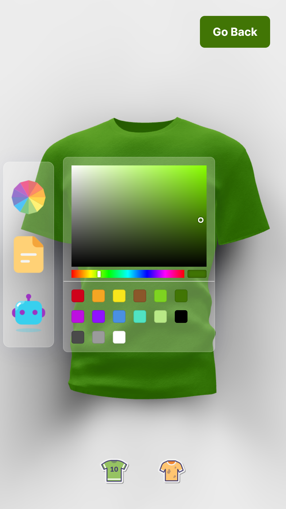
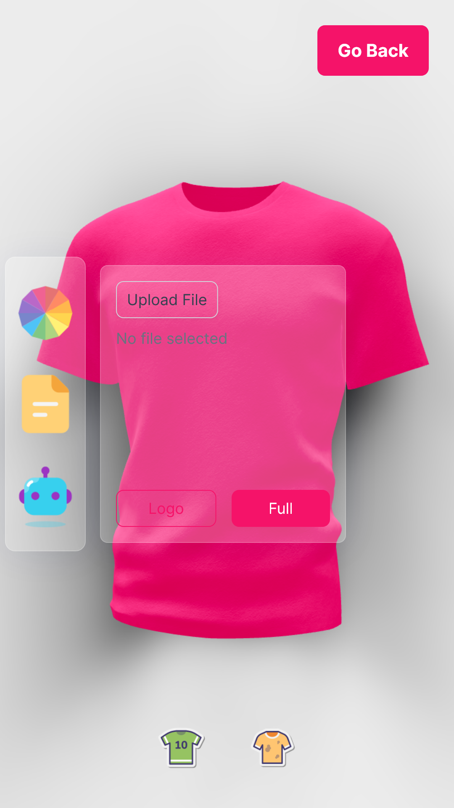

# AI ThreeJS Product Web Application

Hi Future Developer!

Welcome to my project! This time, I'm crafting a cutting-edge web application that's not only powerful but also seamlessly integrated with Artificial Intelligence (AI). This innovative application is all about designing products, particularly T-Shirts, displayed in a remarkably stylish and elegant 3D model that's fully customizable to suit your preferences.

Within this app, you'll find an array of user-friendly functions, including:

- [x] Crafting T-Shirt designs using a sophisticated 3D model
- [x] Effortlessly changing T-Shirt colors with a handy color picker
- [x] Swapping out logos or textures on the T-Shirt by uploading your own images
- [x] Harnessing AI to generate unique logos or textures for your T-Shirt

While the application is still in its developmental stage and may have some limitations, I'm eager to provide users with a valuable experience that can evolve and improve over time. Your input and experience will help shape the future of this exciting project.

Thank you for your interest. Happy coding!

## Environment

- [NextJs](https://nextjs.org/)
- [ThreeJs](https://threejs.org/)
- [TailwindCss](https://tailwindcss.com/)
- [OpenAI](https://openai.com/)

## Contributing

Hey there, come join our awesome project. We welcome your ideas, critiques, suggestions, and pull requests. Show some love with a ⭐ and consider donating to fuel the app's growth! 🚀

## License

Guess what? This project dances to the beat of the [MIT License](https://github.com/novaardiansyah/ai-threejs-product/blob/main/LICENSE)! 🎉

## Contact

Feel free to reach out to me via [Email](mailto:novaardiansyah78@gmail.com) or [Whatsapp](https://wa.me/6289506668480?text=Hi%20Nova,%20I%20have%20a%20question%20about%20AI%20ThreeJS%20Product%20Web%20Application). I'm just a message away! 📩

## Preview

Feel free to check out the app's current progress at [https://www.threejs-ai-product.novaardiansyah.site/](https://www.threejs-ai-product.novaardiansyah.site/). Here are some screenshots of the app in action:

  
  

  
  

  

## Status 

****